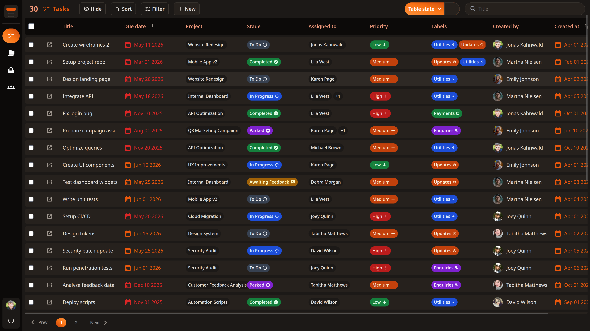
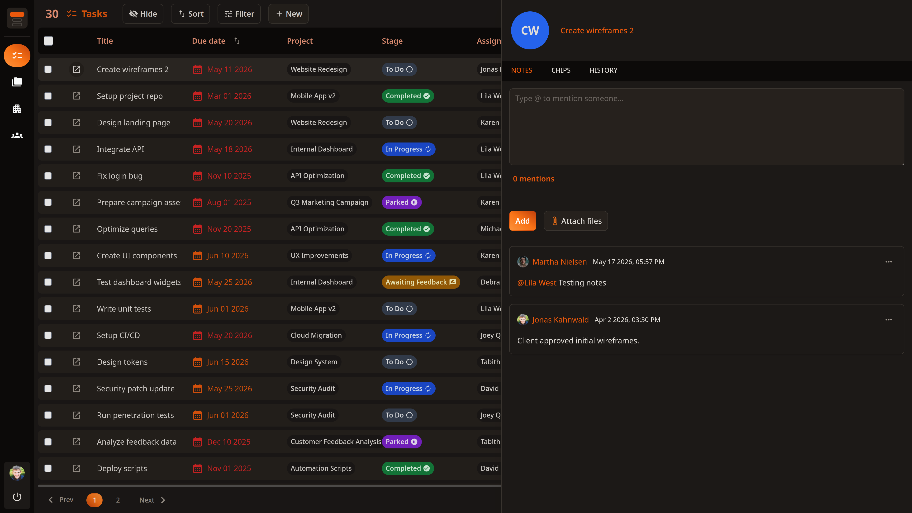
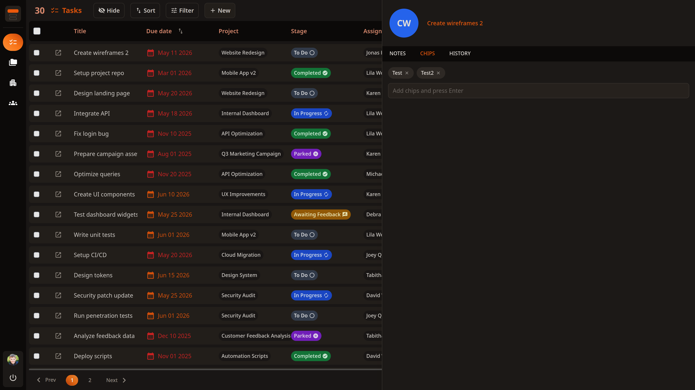
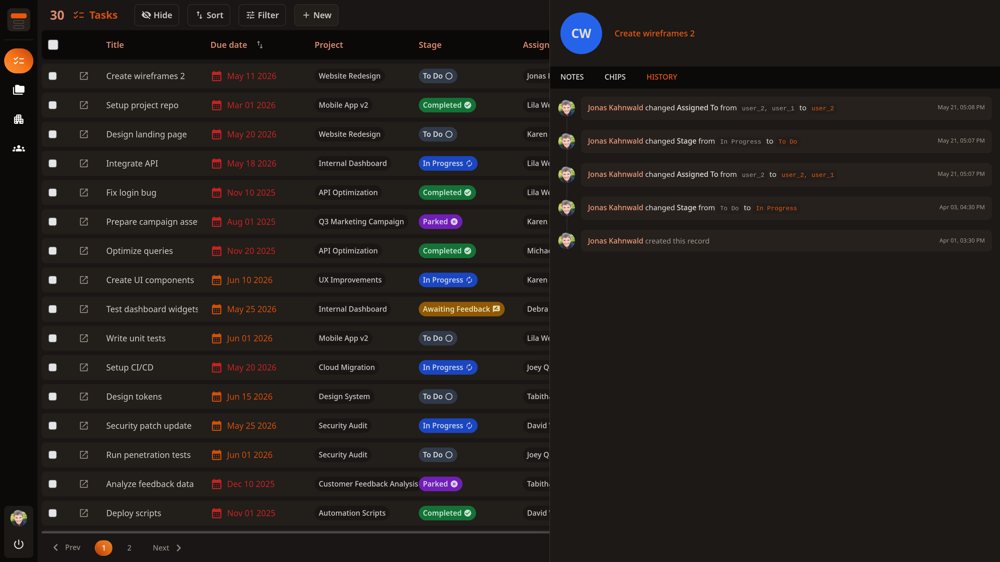
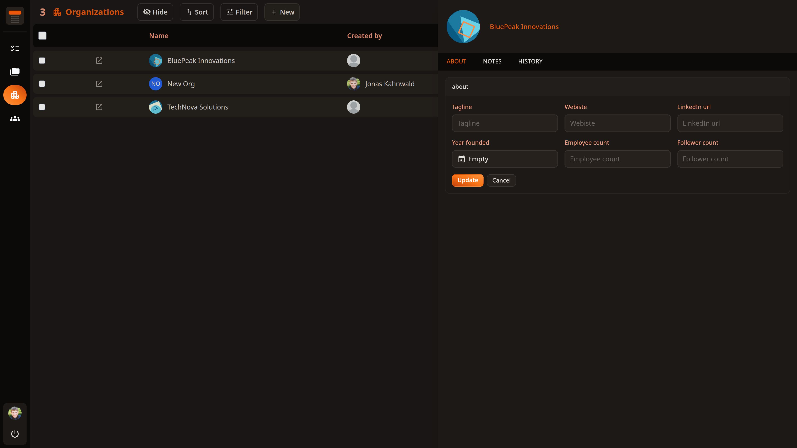
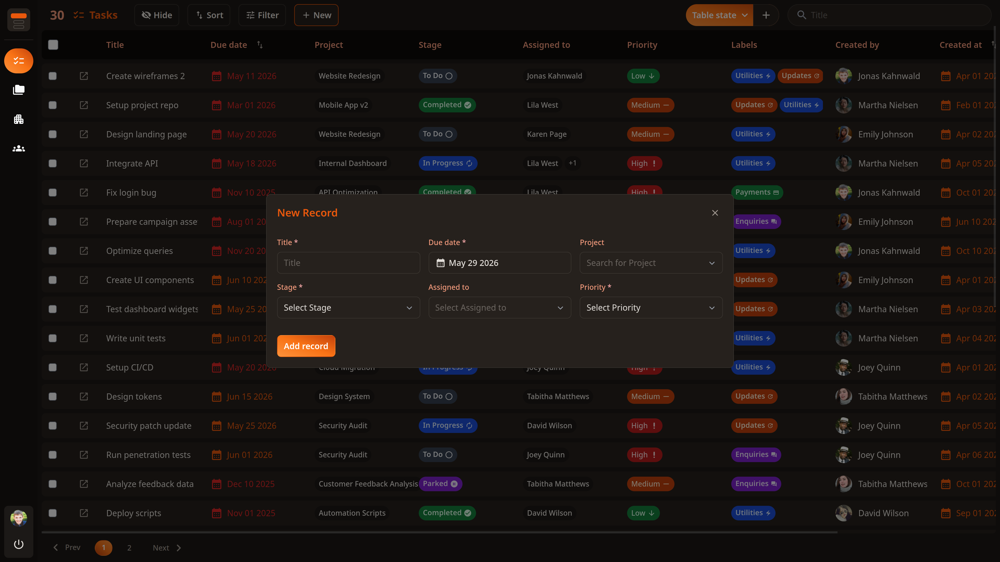
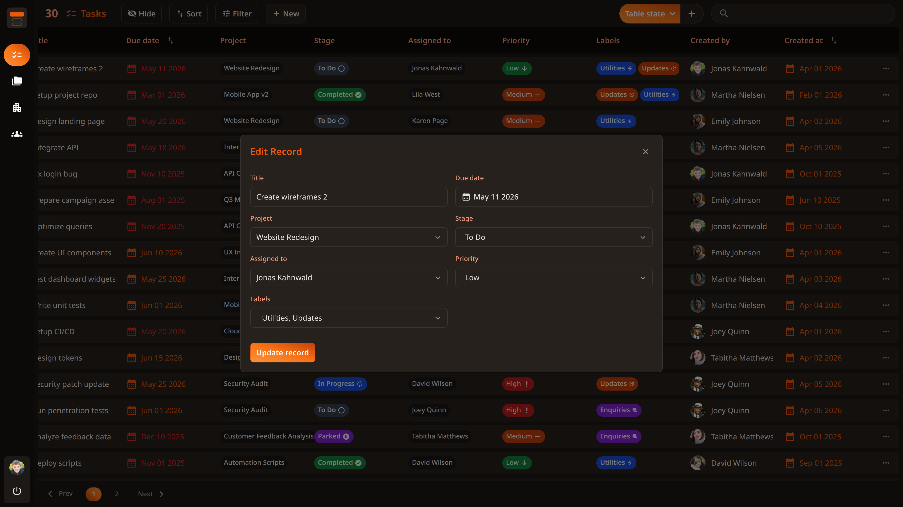
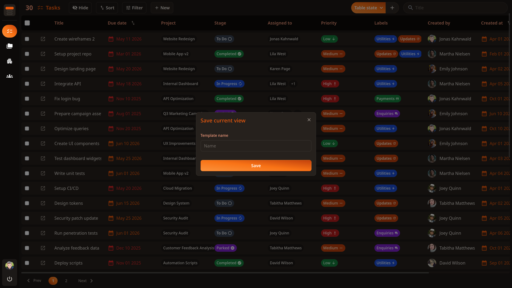
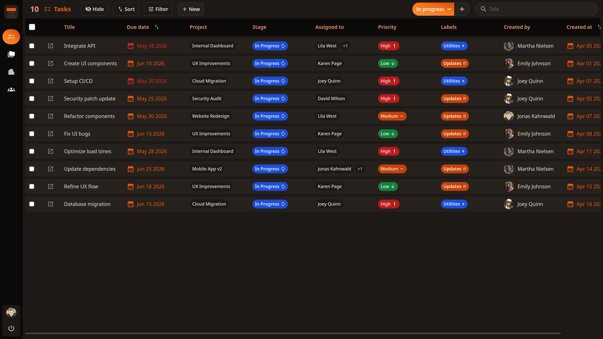
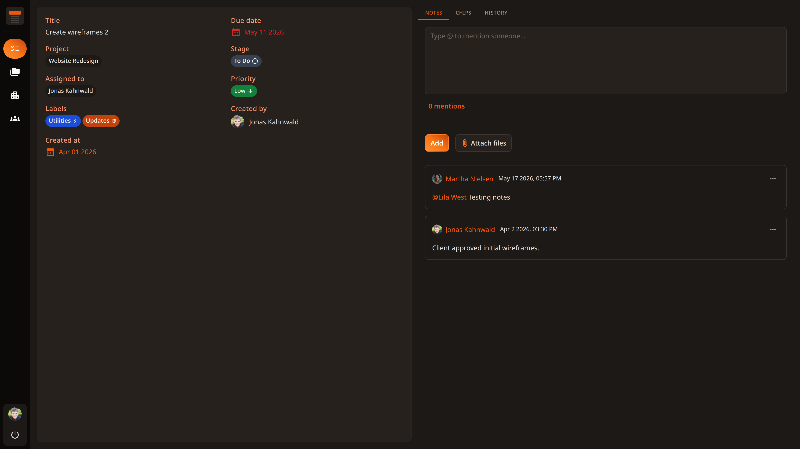

# Tablo

A config-driven table framework built on Nuxt 3. Every column, filter,
permission, and side drawer tab is declared in a JSON file. The table UI,
add/edit modals, search, sort, pagination, and drawer are all generated
automatically from that config.

No login required - starts as `superadmin` by default.

---



---

## What this is

Most data management UIs end up with the same structure repeated per entity - a
table component, an add modal, an edit modal, filters, a side drawer. Tablo
solves this by making that structure driven by a single JSON config file per
entity. The components are written once and reused everywhere.

Instead of ~200 lines of repeated template per entity, you write one JSON file.
The table, add modal, edit modal, filters, sort, side drawer, and role-based
access control all render from it automatically.

The framework was built and used in production across 20+ real applications.
This repository is a cleaned-up, open-source version with a demo data layer
powered by `json-server`.

---

## What it does

- Renders a full paginated, sortable, filterable table from a JSON config
- Generates Add and Edit modals from the same config - no separate form
  components
- Side drawer with Notes, Chips, History, and Details tabs per record
- Role-based field-level access control - read, write, insert, delete per role
- Saved views - save the current sort + filter + column state as a named view,
  shareable via URL
- Inline cell editing with a debounced update queue
- Column reordering via drag and drop
- Multi-select bulk update and delete
- Server-generated audit history on every field change
- Client-side page cache with AbortController to cancel stale requests
- Full-text search per entity
- Per-entity overview page at `/entity/[id]` with a two-column detail layout

---

## How it works

**01 - Write a table config.** Define your fields in a JSON file - name, type,
visibility, filters, permissions, and the component that renders each cell.

**02 - Create a Pinia store.** Wire up a store using the API resource factory.
Pass your API path - CRUD, pagination, cache, search, and notes are all
included.

**03 - Add a page.** Pass your store and config to `Table/Wrapper`. The toolbar,
modals, side drawer, pagination, and bulk actions render automatically.

---

## Getting started

### Prerequisites

- Node.js 18+
- npm

### 1. Clone and install

```bash
git clone https://github.com/AzzVipe/tablo.git
cd tablo
npm install --legacy-peer-deps
```

### 2. Set up the demo data

The `json-server` folder includes a `sample.json` with pre-populated demo data.
Rename it to `db.json` before starting the server:

```bash
cd json-server
mv sample.json db.json
```

### 3. Start the demo API

The demo runs against a local `json-server` instance. No real backend needed.

```bash
npm install
node server.js
```

You should see:

```
Demo API running at http://localhost:3001
Endpoints: /users /projects /tasks /notes /organizations
```

### 4. Set up environment

```bash
cp .env.example .env
```

The `.env.example` is pre-filled for demo mode - no changes needed.

### 5. Run the app

```bash
npm run dev
```

Open `http://localhost:3000` - you land directly on the Tasks table as
`superadmin` with no login screen.

### Connect your real backend

The demo uses `json-server` locally. Update `DEMO_BASE` in
`composables/useAPI.js` to your server URL and everything works immediately.

---

## Testing different roles

Open `composables/useAuth.js` and change the `role` in `DEMO_USER`:

```js
const DEMO_USER = {
  id: "user_1",
  name: "Azmat Ali",
  role: "team", // try: superadmin, admin, team
  ...
}
```

Switch to `team` and the Users and Organizations pages disappear from the
sidebar, write permissions are removed from the table, and the Add button hides

- all driven by the config, no code changes.

| Role       | Read | Create | Edit | Delete | All pages |
| ---------- | ---- | ------ | ---- | ------ | --------- |
| superadmin | ✓    | ✓      | ✓    | ✓      | ✓         |
| admin      | ✓    | ✓      | ✓    | ✓      | ✓         |
| team       | ✓    | ✕      | ✕    | ✕      | ✕         |

---

## Adding a new table

Run the scaffold script from the project root:

```bash
node scripts/create-table.js
# Enter the table name when prompted: invoice
```

This creates:

- `pages/invoices/index.vue`
- `pages/invoices/[id].vue`
- `stores/invoice.js`
- `composables/useInvoice.js`
- `components/SideDrawer/Invoice.vue`
- `table_configs/invoice.json`

Then edit `table_configs/invoice.json` to define your columns and add the page
to `table_configs/pages.json`.

---

## Side drawer

Click any row to open its side drawer without leaving the table. The drawer has
four built-in tabs - each declared in the table config.



**Notes** - Rich text notes with `@mention` support. Mentions are tokenized and
rendered as named links. Supports attachments stored locally in demo mode.



**Chips** - Tag-style multi-value editor for any array field. Add by typing and
pressing Enter, remove by clicking. Changes emit to the store immediately.



**History** - Server-generated audit trail. Every field change on PATCH is
automatically recorded - user, field name, old value, new value, and timestamp.



**Details** - Editable field panel. All fields marked as visible are shown with
their current values. Double-click any field to edit it inline.

Adding a new tab type means creating a `SideDrawer/Tabs/YourTab.vue` component
and registering it in the `SideDrawer/Tabs/index.vue` component.

---

## Add and edit modals



The Add and Edit modals are generated from the same table config. Fields marked
`creatable: true` appear in Add; fields marked `editable: true` appear in Edit.
Field order, input type, required state, and dropdown options all come from the
config. You never write a form component by hand.



The edit modal pre-populates with current values and only sends changed fields
to the API.

---

## Table state (saved views)



Table state captures your current sort, active filters, and hidden columns as a
named view. The state is serialized into the URL - copy the link and anyone who
opens it sees the same filtered, sorted table.



When a saved view is active, the record count updates to match and the table
state button shows the view name.

---

## Overview page



Every entity has an `/entity/[id]` route that renders a full detail view -
fields on the left, drawer tabs on the right. Double-click any field to edit it
inline. The same table config drives what's shown here.

---

## Extensibility

Tablo is a starter kit, not a closed library. The built-in tabs (Notes, Chips,
History, Details), input types (text, date, select, relation), and cell
renderers are just the defaults that ship with the demo - they're regular Vue
components, nothing special about them. You're meant to add your own alongside
them.

Want a drawer tab that shows linked invoices for a contact? One component file.
Need a rich text input type that doesn't exist yet? Add a component to `Form/`
and one `v-else-if` in `Form/Fields.vue`. Want to expose a new field behavior
from the table config - a toggle, a computed cell, a custom action? The JSON
config is designed to be extended with whatever keys your components need to
read.

The demo also runs against `json-server` purely so you can try it without any
setup. Swap `DEMO_BASE` in `composables/useAPI.js` to point at your real backend
and the whole thing works against your actual data - no other changes needed.

Everything is a plugin point. Adding new capabilities never touches the core
framework - it's always one new file:

| What               | How                                                                                      | File                        |
| ------------------ | ---------------------------------------------------------------------------------------- | --------------------------- |
| New table          | Run the scaffold script - page, store, config, and side drawer component created for you | `scripts/create-table.js`   |
| New cell component | Create a Vue component in `Table/Cells/` and reference it by name in the config          | `Table/Cells/MyCell.vue`    |
| New form input     | Add a component to `Form/` and add a `v-else-if` in `Form/Fields.vue` for the new type   | `Form/MyInput.vue`          |
| New drawer tab     | Create a tab component in `SideDrawer/Tabs/` and register it in `tab_headers`            | `SideDrawer/Tabs/MyTab.vue` |

---

## Project structure

```
tablo/
├── assets/css/
│   └── main.css              # Design tokens + global styles (CSS variables)
├── components/
│   ├── Form/                 # Input components (text, date, dropdowns, relation)
│   ├── Table/
│   │   ├── Actions/          # Toolbar: filter, sort, hide, table state, bulk actions
│   │   ├── Cells/            # Cell renderers: date, people, multi-value, toggle
│   │   ├── Modals/           # Add and Edit modals
│   │   └── Wrapper.vue       # Main table orchestrator - reads config, renders everything
│   ├── SideDrawer/
│   │   └── Tabs/             # Notes, Chips, History, Details tab components
│   └── Ui/
│       ├── Logo.vue          # Tablo brand logo component
│       └── Sidebar.vue       # Navigation sidebar
├── composables/
│   ├── api/                  # Split API layer: fetch, crud, notes, helpers
│   ├── useAPIResource.js     # Exports all API functions as one composable
│   ├── useApiStore.js        # Generic store factory (deprecated, kept for reference)
│   ├── useAuth.js            # Demo auth - hardcoded current user
│   └── useUpdateQueue.js     # Debounced update queue for inline cell edits
├── json-server/
│   ├── server.js             # Demo API with custom middleware for filters, search, populate
│   └── db.json               # Demo data (tasks, projects, users, organizations, notes)
├── pages/                    # One folder per entity (tasks, projects, users, organizations)
├── stores/                   # One Pinia store per entity
├── table_configs/            # JSON config per entity - this is where everything starts
│   ├── pages.json            # Sidebar navigation and role-based page visibility
│   ├── task.json
│   ├── project.json
│   ├── user.json
│   └── organization.json
├── scripts/
│   └── create-table.js       # Scaffold script for adding new entities
└── utils/                    # Pure utility functions
    ├── guards.js             # isNullOrUndefined, isNullOrUndefinedOrEmpty
    ├── path.js               # getPathFromHeader, getValueByPath, setValueByPath
    ├── formatters.js         # formatDate, formatSize
    ├── colors.js             # getOptionColor, getPipelineColor
    ├── arrays.js             # compareArrays
    ├── permissions.js        # setTableRules, findFieldPermissions
    ├── buildMatchString.js   # Converts filter objects to API match string
    └── tableState.js         # TableState serialization and URL helpers
```

---

## Table config reference

Every entity has a JSON file in `table_configs/` with three sections: `config`
(columns), `tab_headers` (side drawer tabs), and `roles` (permissions).

### Column fields (`config`)

```json
{
	"name": "Priority",
	"type": "select",
	"path": "priority",
	"visible": true,
	"creatable": true,
	"editable": true,
	"sort": false,
	"filter": true,
	"bulk_editable": true,
	"required": false,
	"component": "TableCellsMultiValue",
	"render_as": "stage",
	"options": [
		{
			"name": "Low",
			"value": "Low",
			"class": "bg-green-700 text-green-100",
			"icon": "ic:round-arrow-downward"
		},
		{
			"name": "Medium",
			"value": "Medium",
			"class": "bg-orange-700 text-orange-100",
			"icon": "ic:round-horizontal-rule"
		},
		{
			"name": "High",
			"value": "High",
			"class": "bg-red-700 text-red-100",
			"icon": "ic:round-priority-high"
		}
	]
}
```

| Key             | Type    | Description                                                           |
| --------------- | ------- | --------------------------------------------------------------------- |
| `name`          | string  | Column header label and form field label                              |
| `type`          | string  | Field type - see type system below                                    |
| `path`          | string  | Dot-notation path on the record (e.g. `"createdBy.name"`)             |
| `visible`       | boolean | Whether the column appears in the table                               |
| `creatable`     | boolean | Whether the field appears in the Add modal                            |
| `editable`      | boolean | Whether the field appears in the Edit modal                           |
| `sort`          | boolean | Whether the column header is clickable to sort                        |
| `filter`        | boolean | Whether the field appears in the Filter dropdown                      |
| `bulk_editable` | boolean | Whether the field can be bulk-updated across selected rows            |
| `required`      | boolean | Marks the field as required in forms                                  |
| `searchable`    | boolean | Whether this field is included in full-text search                    |
| `component`     | string  | Vue component name used to render the cell                            |
| `render_as`     | string  | Display variant for `TableCellsMultiValue`: `stage`, `assign`, `chip` |
| `options`       | array   | Dropdown options - each has `name`, `value`, `class`, `icon`          |
| `image_path`    | string  | Path to an avatar/image field shown alongside the value               |
| `date_format`   | string  | Format string for date display (e.g. `"MMM DD YYYY"`)                 |
| `flag_overdue`  | boolean | Colors the date red when past due                                     |
| `default_value` | string  | Default value for Add modal (e.g. `"now + 7d"` for dates)             |

### Field types

| Type             | Description                                            | Form component                  |
| ---------------- | ------------------------------------------------------ | ------------------------------- |
| `text`           | Plain text input                                       | `<input type="text">`           |
| `textarea`       | Multi-line text                                        | `<textarea>`                    |
| `number`         | Numeric input                                          | `<input type="number">`         |
| `date`           | Date picker                                            | `Form/DatePicker.vue`           |
| `select`         | Single value from a predefined options list            | `Form/SingleSelectDropdown.vue` |
| `multi-select`   | Multiple values from a predefined options list         | `Form/MultiSelectDropdown.vue`  |
| `relation`       | Single record from another entity (fetched from store) | `Form/AssignDropdown.vue`       |
| `multi-relation` | Multiple records from another entity                   | `Form/MultiAssignDropdown.vue`  |

### Relation fields

When `type` is `relation` or `multi-relation`, add these keys:

```json
{
	"type": "multi-relation",
	"path": "assignedTo",
	"source": "userStore",
	"source_value": "id",
	"source_field": "name",
	"source_image": "avatar"
}
```

| Key            | Description                                                             |
| -------------- | ----------------------------------------------------------------------- |
| `source`       | Pinia store name to pull options from                                   |
| `source_value` | Field on the related record to use as the stored value (usually `"id"`) |
| `source_field` | Field on the related record to display as the label (e.g. `"name"`)     |
| `source_image` | Field on the related record to use as an avatar image                   |
| `filter_field` | API field name used to fetch unique filter values from the server       |

### Side drawer tabs (`tab_headers`)

```json
{
	"tab_headers": {
		"notes": {
			"type": "notes",
			"header": {
				"name": "Notes",
				"path": "notes",
				"visible": true,
				"editable": true,
				"attachment": true
			}
		},
		"chips": {
			"type": "chips",
			"header": {
				"name": "Tags",
				"path": "chips",
				"visible": true,
				"editable": true
			}
		},
		"history": {
			"type": "history",
			"header": {
				"name": "History",
				"path": "history",
				"visible": true,
				"editable": false
			}
		}
	}
}
```

Available tab types: `notes`, `chips`, `history`, `details`. Adding a new tab
type means creating a `SideDrawer/Tabs/YourTab.vue` component and adding a
`v-else-if` case in `SideDrawer/Tabs/index.vue`.

`visible` and `editable` on the tab header are used by the permission system to
show/hide the tab per role.

### Roles (`roles`)

```json
{
	"roles": [
		{
			"name": "superadmin",
			"read": true,
			"write": true,
			"insert": true,
			"delete": true,
			"search": true
		},
		{
			"name": "admin",
			"read": true,
			"write": true,
			"insert": true,
			"delete": true,
			"search": true
		},
		{
			"name": "team",
			"read": true,
			"write": false,
			"insert": false,
			"delete": false,
			"search": true
		}
	]
}
```

Permissions apply at the table level. The `setTableRules` utility runs at mount
and stamps the current user's role permissions onto every header object - so
components read `header.permissions.write` directly without re-checking the role
on each render.

---

## Pages config (`table_configs/pages.json`)

Controls which pages appear in the sidebar and which roles can see them.

```json
{
	"config": [
		{
			"name": "Tasks",
			"to": "/tasks",
			"value": "tasks",
			"icon": "ic:round-task"
		},
		{
			"name": "Projects",
			"to": "/projects",
			"value": "projects",
			"icon": "ic:round-folder-open"
		},
		{
			"name": "Organizations",
			"to": "/organizations",
			"value": "organizations",
			"icon": "ic:round-home-work"
		},
		{
			"name": "Users",
			"to": "/users",
			"value": "users",
			"icon": "ic:round-person"
		}
	],
	"roles": [
		{ "name": "superadmin", "visible": true },
		{ "name": "admin", "visible": true },
		{
			"name": "team",
			"visible": true,
			"pages": { "organizations": false, "users": false }
		}
	]
}
```

Setting `"organizations": false` for a role removes it from the sidebar for that
role entirely.

---

## How the API layer works

The `composables/api/` directory contains four files:

- `helpers.js` - shared utilities: context validation, request lifecycle
  (`__performRequest`), cache key creation, sort serialization
- `fetch.js` - read operations: `__fetchData`, `__searchData`, `__findRecords`,
  `__findById`, `__findByField`, `__fetchUniqueFieldValues`, `__refreshRecord`
- `crud.js` - write operations: `__addRecord`, `__updateRecord`,
  `__deleteRecord`, `__updateRecordsMany`, `__deleteRecordsMany`
- `notes.js` - notes and attachments: `__fetchNotes`, `__addNote`,
  `__updateNote`, `__deleteNote`

All functions are exported through `useAPIResource()` and called from Pinia
store actions. Each store passes `this` as the context, which gives the
functions access to the store's state and API path.

`__performRequest` handles the full request lifecycle - aborting in-flight
requests when a new one starts, tracking `isFetching`, and preventing stale
responses from overwriting fresh data using a `Symbol`-based request ID.

---

## Theming

All colors are CSS custom properties in `assets/css/main.css`, structured in two
layers:

**Primitive tokens** - the actual color values:

```css
:root {
	--stone-950: #0c0a09;
	--stone-900: #1c1917;
	--orange-focus: #ea580c;
}
```

**Semantic tokens** - mapped to primitives by purpose:

```css
:root {
	--page-bg: var(--stone-900);
	--card-bg: var(--stone-750);
	--text-title: var(--orange-focus);
	--input-bg: var(--stone-750);
}
```

The current theme uses a dark stone palette with an orange primary. To change
it, update the primitive values - all 40+ semantic tokens and all `@nuxt/ui`
component overrides in `app.config.ts` update automatically.

---

## Demo server

The demo API is a custom `json-server` instance with middleware for:

- **Filtering** - `?filter=priority=High` or `?filter=priority=(Low,High)` or
  `?filter=priority!=Low`
- **Search** - `GET /tasks/search?searchToken=wireframe`
- **Relation populate** - every GET response populates relation fields (e.g.
  `assignedTo` returns full user objects, not just IDs)
- **Unique field values** - `GET /tasks/fields/assignedTo` returns a
  `{ id: name }` map for filter dropdowns
- **Auto-generated prefixed IDs** - new records get IDs like
  `task_1716912345_ab3f2`
- **Server-generated history** - every PATCH request writes a history entry
  comparing old vs new field values

Connecting to a real backend is a one-line change in `composables/useAPI.js` -
update `DEMO_BASE` to your server URL.

---

## Tech stack

- **Nuxt 3** with Vue 3 Composition API
- **Pinia** - state management with client-side page cache
- **@nuxt/ui** - dropdowns, modals, popovers, tabs
- **Tailwind CSS** - utility styling
- **vuedraggable** - column reordering
- **v-calendar** - date picker
- **json-server** - demo API layer

---

## License

MIT License - see [LICENSE](LICENSE) for details.
